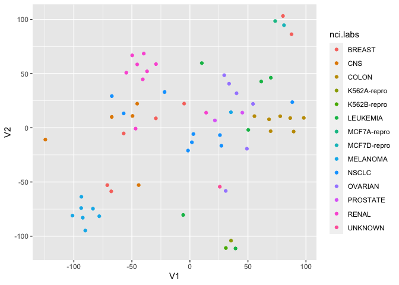
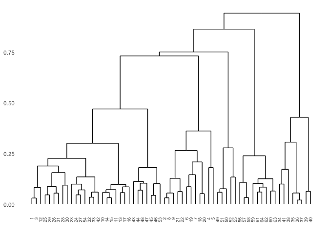

Gower’s dissimilarity in hierarchical clustering using Ward’s method
================
Elsie Horne
16/01/2019

# Introduction

Hierachical clustering using Ward’s method is a popular technique for
clustering data. At each level of the hierarchy, two clusters are
merged, chosen such that the merge results in the smallest increase in
error sum of squares between samples in the data and their corresponding
cluster centres, i.e. the sum of squared Euclidean distances between
samples and corresponding cluster centres.

Some studies have been identified which use hierachical clustering using
Ward’s method, but use a distance matrix calculated using the Gower
dissimilarity as input. A limitation with this method is that, for
speed, the function `cluster::agnes` uses properites of the squared
Euclidean distance to avoid having to recalculate distances to the
updated cluster centres at each level of the hierarchy. In the following
example, I investigate whether using the Gower dissimilarity measure as
input to `cluster::agnes` gives the same results as using hierachical
clustering using Ward’s method where all distance calculations use the
Gower dissimilarity instead of the squared Euclidean distance.

**Note**: typically the rationale for using the Gower dissimilarity is
that the data contains both continuous and categorical features.
However, the example I give here uses only continuous features. If the
Gower dissimilarities were used in Ward’s method, it would involve
calculating the distance between a categorical variable (e.g. 1) and the
cluster mean of the categorical variable (e.g. 0.63). Therefore this
variable would have to be treated as a continuous variable for the
purposes of calculating Gower dissimilarities, in which case the Gower
dissimilarity becomes equivalent to the range normalised Manhatton
distance.

# Example

The following line loads the functions that I’ve written to implement
Ward’s clustering computing a new distance matrix for each level of the
hierarchy, rather than the approach taken in `cluster::agnes` which
relies on properties of the squared Euclidean distance. The code for
these functions is included in the appendix at the end of this document.

``` r
source("functions_wards.R")
```

    ## Loading required package: arrangements

    ## Warning in library(package, lib.loc = lib.loc, character.only = TRUE,
    ## logical.return = TRUE, : there is no package called 'arrangements'

The data for this example is the NCI60 microarray data, loaded from the
package `ISLR`. This example is adapted from ‘10.6 Lab 3: NCI60 Data
Example’ of ‘Introduction to Statistical Learining’ (ISLR).

``` r
nci.labs <- NCI60$labs
nci.data <- NCI60$data
dim(nci.data)
```

    ## [1]   64 6830

## Exploratory data analysis

This data has 6830 features, so I use a projection technique called
t-distributed stochastic neightbour embedding (t-SNE) tsne to visualise
the data in 2 dimensions and get an initial feeling of whether there is
some clustering corresponding to the `nci.labs`. The function `Rtsne`
first reduces the data to 30 dimensions (`initial_dims = 30,`) using
principal components analysis (PCA) before applying t-SNE to learn a
2-dimensional embedding (`dims = 2`). The Barnes-Hut approximation was
not used (`theta = 0`) and the perplexity was set to 5, which is low as
it is a small and sparsely distributed dataset. The 2-dimensional
embedding of the data can be visualised in a scatter plot. The colours
in the plot below correspond to the type of cancer (`nci.labs`). It
looks as though there is some grouping in the data which corresonds to
the type of cancer. I now investigate this further with cluster
analysis.

``` r
tmp <- data.frame(nci.data, scale = TRUE)
# tsne_30 <- Rtsne(tmp, dims = 2, initial_dims = 30, perplexity = 5, theta = 0, pca = TRUE)
# save(tsne_30, file = "tsne_30.RData")
load("tsne_30.RData")
tmp <- as.data.frame(tsne_30$Y)
tmp <- cbind(tmp, nci.labs)
tmp <- tmp %>% mutate_at("nci.labs", as.factor)
ggplot(data = tmp) + geom_point(aes(x = V1, y = V2, colour = nci.labs))
```

<!-- -->

## Dimensionality reduction

As the dataset is high-dimensional, I first use PCA to reduce
dimensions. Here I standardise the data and reduce it to 5 dimensions,
as in the ISLR example.

**Note:** It is necessary to standardise the data here as I am using the
squared Euclidean distance. If I were only using the Gower dissimilarity
this would not be necessary, as the Gower dissimilarity uses the
range-normalised Manhatton distance for continuous variables so returns
the same distance matrix for standardised and unstandardised data.

``` r
pr.out <- prcomp(nci.data, scale=TRUE)
x <- pr.out$x[,1:5]
rownames(x) <- 1:nrow(x)
```

## Cluster analysis

### Euclidean distance

First I compare results from `cluster::agnes` and `my_wards` using the
squared Euclidean distance to ensure that they are identical.

#### agnes

``` r
d_euc <- daisy(x, metric = "euclidean", stand = FALSE)
ag_euc <- agnes(d_euc, method = "ward", stand = FALSE)
```

#### my\_wards

This taks a few minutes to run so has been saved and loaded.

``` r
#my_euc <- my_wards(x, dist = "euclidean")
#save(my_euc, file = "my_euc.RData")
load("my_euc.RData")
```

Check all the distances between merges are the same.

``` r
all(near(sort(ag_euc$height), unname(unlist(my_euc))))
```

    ## [1] TRUE

The are, so when using the Euclidean matrix the two functions give the
same solution.

### Gower dissimilarity

Now try with the Gower dissimilarity

#### agnes

``` r
d_gow <- daisy(x, metric = "gower", stand = FALSE)
ag_gow <- agnes(d_gow, method = "ward", stand = FALSE)
```

#### my\_wards

``` r
#my_gow <- my_wards(x, dist = "gower")
#save(my_gow, file = "my_gow.RData")
load("my_gow.RData")
```

Check if the distances afe all the same:

``` r
near(sort(ag_gow$height), unname(unlist(my_gow)))
```

    ##  [1]  TRUE  TRUE  TRUE  TRUE  TRUE  TRUE  TRUE  TRUE  TRUE  TRUE  TRUE FALSE
    ## [13] FALSE FALSE FALSE FALSE FALSE  TRUE  TRUE  TRUE  TRUE  TRUE FALSE FALSE
    ## [25] FALSE FALSE FALSE FALSE FALSE FALSE FALSE FALSE FALSE FALSE FALSE FALSE
    ## [37] FALSE FALSE FALSE FALSE FALSE FALSE FALSE FALSE FALSE FALSE FALSE FALSE
    ## [49] FALSE FALSE FALSE FALSE FALSE FALSE FALSE FALSE FALSE FALSE FALSE FALSE
    ## [61] FALSE FALSE FALSE

``` r
sort(ag_gow$height)/unname(unlist(my_gow))
```

    ##  [1] 1.0000000 1.0000000 1.0000000 1.0000000 1.0000000 1.0000000 1.0000000
    ##  [8] 1.0000000 1.0000000 1.0000000 1.0000000 0.9777971 0.9775991 1.0032989
    ## [15] 1.0264446 1.0231045 1.0089887 1.0000000 1.0000000 1.0000000 1.0000000
    ## [22] 1.0000000 0.9925793 0.9536054 0.9513463 1.0217912 1.0410276 1.0447580
    ## [29] 1.0354007 1.0429300 1.0889797 0.9886133 0.9969919 0.9769313 0.9913864
    ## [36] 0.9711469 0.9806035 0.9939123 0.9754309 1.0338999 0.9964393 1.0406513
    ## [43] 1.0043601 0.9670595 0.9426034 0.9985131 1.0367316 1.0345506 1.0202894
    ## [50] 1.0323883 1.0603133 1.0207567 1.0760676 0.9738197 0.9791576 0.9966992
    ## [57] 0.9306807 1.0513793 1.1491615 0.9680913 0.9685066 1.0739396 0.9583270

This time some of the distances are different. The differences are not
huge though, so take a look to see how it affects the custering.

Use the dendrogram from the `agnes` clustering to select a `k` to
compare solutions.

``` r
ggdendrogram(ag_gow) +
  theme(axis.text.x = element_text(angle = 90, hjust = 1, size = rel(0.8)))
```

    ## Warning in if (dataClass %in% c("dendrogram", "hclust")) {: the condition has
    ## length > 1 and only the first element will be used

    ## Warning in if (dataClass %in% c("dendrogram", "hclust")) {: the condition has
    ## length > 1 and only the first element will be used

<!-- -->

From the dendrogram of the agnes clustering, 5 clusters seems
reasonable. Tabulate the 5 cluster solutions obtained from both
functions.

``` r
ag_5 <- cutree(ag_gow, k = 5)
my_5 <- my_clusters(my_gow, k = 5)

table(ag_5, my_5)
```

    ##     my_5
    ## ag_5  1  2  3  4  5
    ##    1  0  0  3  0 27
    ##    2  0  0 12  0  0
    ##    3  0  0  0  8  0
    ##    4  0  5  0  0  0
    ##    5  9  0  0  0  0

Only 3 samples have been reallocated. Take a look at how this solution
corresponds to the types of cancer.

``` r
table(nci.labs, ag_5)
```

    ##              ag_5
    ## nci.labs      1 2 3 4 5
    ##   BREAST      0 3 0 2 2
    ##   CNS         2 3 0 0 0
    ##   COLON       7 0 0 0 0
    ##   K562A-repro 0 0 1 0 0
    ##   K562B-repro 0 0 1 0 0
    ##   LEUKEMIA    0 0 6 0 0
    ##   MCF7A-repro 0 0 0 1 0
    ##   MCF7D-repro 0 0 0 1 0
    ##   MELANOMA    1 0 0 0 7
    ##   NSCLC       6 2 0 1 0
    ##   OVARIAN     5 1 0 0 0
    ##   PROSTATE    2 0 0 0 0
    ##   RENAL       7 2 0 0 0
    ##   UNKNOWN     0 1 0 0 0

``` r
table(nci.labs, my_5)
```

    ##              my_5
    ## nci.labs      1 2 3 4 5
    ##   BREAST      2 2 3 0 0
    ##   CNS         0 0 5 0 0
    ##   COLON       0 0 0 0 7
    ##   K562A-repro 0 0 0 1 0
    ##   K562B-repro 0 0 0 1 0
    ##   LEUKEMIA    0 0 0 6 0
    ##   MCF7A-repro 0 1 0 0 0
    ##   MCF7D-repro 0 1 0 0 0
    ##   MELANOMA    7 0 0 0 1
    ##   NSCLC       0 1 2 0 6
    ##   OVARIAN     0 0 1 0 5
    ##   PROSTATE    0 0 0 0 2
    ##   RENAL       0 0 3 0 6
    ##   UNKNOWN     0 0 1 0 0

This has resulted in very minor changes - `my_wards` has grouped all 5
`CNS` cancers into one cluster while `agnes` has split them across two
clusters (2|3). The split for `RENAL` from my\_wards is 7|2 and 6|3 for
agnes. Other than this the solutions are identical.

# Conclusions

Differences between the solutions arise because `agnes` does calucate
the exact Gower dissimilarities In this example with 5 features and 64
samples the differences were fairly minor. However, the differences are
likely to be mre pronounced with larger datasets.

(The current implementation of `my_wards` is slow, so it is only
feasible with small datasets.)

# Appendix

Below is the code for each of the functions.

``` r
my_wards
```

    ## function (x, dist) 
    ## {
    ##     ess_direct <- function(C) {
    ##         C <- str_c(C, collapse = ",")
    ##         C_ind <- unlist(str_split(C, ","))
    ##         if (length(C_ind) == 1) 
    ##             return(0)
    ##         else {
    ##             d <- d_current[C, C_ind]
    ##             return(sum(d * d))
    ##         }
    ##     }
    ##     change_ess_direct <- function(L) {
    ##         ess_direct(c(L[1], L[2])) - ess_direct(L[1]) - ess_direct(L[2])
    ##     }
    ##     my_mean <- function(combo) {
    ##         combo <- unlist(str_split(combo, ","))
    ##         x_mean <- colMeans(x_current[combo, ])
    ##     }
    ##     levs <- nrow(x) - 1
    ##     merges <- vector(mode = "list", length = levs)
    ##     names <- vector(mode = "list", length = levs)
    ##     clusters <- as.character(1:nrow(x))
    ##     x_rows <- as.character(1:nrow(x))
    ##     x_current <- x
    ##     for (i in 1:levs) {
    ##         combos <- as.data.frame(t(combinations(x = clusters, 
    ##             k = 2))) %>% mutate_all(as.character)
    ##         names(combos) <- unname(apply(as.matrix(combos), 2, function(x) str_c(x, 
    ##             collapse = ",")))
    ##         means <- sapply(combos, my_mean)
    ##         means <- as.data.frame(t(means))
    ##         x_current <- rbind(x_current, means)
    ##         d_current <- daisy(x_current, metric = dist, stand = FALSE)
    ##         d_current <- as.matrix(d_current)
    ##         d_combos <- lapply(combos, change_ess_direct)
    ##         names(d_combos) <- unname(apply(as.matrix(combos), 2, 
    ##             function(x) str_c(x, collapse = " and ")))
    ##         d_combos <- unlist(d_combos)
    ##         d_combos <- (2 * d_combos)^0.5
    ##         d_min <- min(d_combos)
    ##         c_rem <- combos[d_combos == d_min]
    ##         merges[i] <- d_min
    ##         c_rem <- as.character(unlist(c_rem))
    ##         c_new <- str_c(unlist(c_rem), collapse = ",")
    ##         clusters <- clusters[!(clusters %in% c_rem)]
    ##         clusters <- c(clusters, c_new)
    ##         x_rows <- c(x_rows, c_new)
    ##         x_current <- x_current[x_rows, ]
    ##         names[i] <- str_c(clusters, collapse = "--")
    ##     }
    ##     names(merges) <- names
    ##     return(merges)
    ## }

``` r
my_clusters
```

    ## function (my_wards_out, k) 
    ## {
    ##     r <- names(my_wards_out)
    ##     r <- r[[nrow(x) - k]][[1]]
    ##     r <- str_split(r, "--")[[1]]
    ##     r <- sapply(r, function(x) str_split(x, ","))
    ##     r <- sapply(r, as.numeric)
    ##     x_r <- data.frame()
    ##     for (i in 1:length(r)) {
    ##         m_r <- matrix(data = c(r[[i]], rep(i, length = length(r[[i]]))), 
    ##             ncol = 2)
    ##         m_r <- as.data.frame(m_r)
    ##         x_r <- rbind(x_r, m_r)
    ##     }
    ##     x_r <- unname(unlist(arrange(x_r, V1)[2]))
    ##     return(x_r)
    ## }
    ## <bytecode: 0x7fef3b900860>
